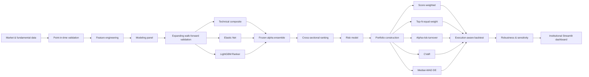

# Institutional Quant Equity Research Platform

An end-to-end quantitative equity research platform for systematic US equity
selection, portfolio construction, risk modeling, execution-aware backtesting,
robustness analysis, and interactive research reporting.

The project is designed as a portfolio-grade research system rather than a single
notebook or isolated model. It connects point-in-time data engineering, predictive
modeling, portfolio construction, implementation costs, validation controls, and
a Streamlit dashboard through reproducible Python pipelines.

> **Research use only.** All results are historical out-of-sample research outputs.
> They are not investment advice and do not represent live trading performance.

---

## Overview

The platform studies whether cross-sectional market and fundamental signals can
identify US equities with superior future relative returns, and whether those
signals can be converted into implementable long-only portfolios under realistic
risk, concentration, turnover, and transaction-cost constraints.

The current research configuration uses:

- **Market:** United States
- **Universe:** 50 liquid equities across 11 sectors
- **Signal frequency:** monthly
- **Primary prediction horizon:** 21 trading sessions
- **Benchmark:** SPY
- **Portfolio style:** long-only
- **Maximum security weight:** 5%
- **Maximum sector weight:** 25%
- **Out-of-sample signal period:** 2020-01-31 to 2026-05-29
- **Portfolio evaluation through:** 2026-06-30

The research pipeline includes 151 monthly cross-sections from 2014 onward, with
the early history used to establish expanding walk-forward training windows before
the final out-of-sample evaluation period.

---

## Research architecture



---

## Predictive modeling

The final modeling panel contains **91 candidate predictors**:

| Feature family | Features |
|---|---:|
| Technical / market | 19 |
| Fundamental global z-scores | 24 |
| Fundamental sector z-scores | 24 |
| Fundamental missingness indicators | 24 |
| **Total** | **91** |

The frozen alpha signal combines three complementary components:

1. **Technical composite** — transparent cross-sectional market features.
2. **Elastic Net** — regularized linear signal with embedded feature selection.
3. **LightGBM Ranker** — non-linear cross-sectional ranking model.

Model selection and hyperparameter choices are performed inside the walk-forward
research process. The final full-model specification is treated as frozen for
out-of-sample interpretation.

### Frozen alpha evidence

The final signal-level bootstrap reports:

| Metric | Result |
|---|---:|
| Mean monthly Spearman IC | **0.041** |
| Mean IC 95% CI | **[-0.002, 0.082]** |
| Probability mean IC > 0 | **96.8%** |
| Mean top-bottom spread | **1.23%** |
| Probability mean spread > 0 | **99.7%** |

These statistics are research evidence about the shared cross-sectional signal.
They do not change with the portfolio-construction method selected in the
dashboard.

---

## Portfolio construction

Five portfolio-construction methods are evaluated from the same frozen ranking:

| Method | Purpose |
|---|---|
| **Score Weighted** | Direct score-based long-only allocation under concentration controls |
| **Top-N Equal Weight** | Transparent ranking baseline |
| **Alpha-Risk-Turnover** | Optimization balancing predicted alpha, risk, and turnover |
| **CVaR** | Tail-risk-aware portfolio construction |
| **Median-MAD DE** | Robust median-MAD construction using differential evolution |

Common construction constraints include:

- long-only weights,
- maximum 5% security weight,
- maximum 25% sector weight,
- minimum diversification requirements,
- explicit turnover measurement,
- ex-ante risk estimates.

### Score Weighted OOS snapshot

For the default dashboard method:

| Metric | Historical OOS result |
|---|---:|
| Net CAGR | **24.4%** |
| Sharpe ratio | **1.09** |
| Maximum drawdown | **-34.3%** |
| Annualized alpha vs SPY | **+6.7%** |
| Beta vs SPY | **1.06** |
| Mean one-way turnover | **25.9%** |

Performance figures are net of the modeled transaction-cost framework used by the
research backtest.

---

## Risk model

The platform estimates security-level risk and rolling cross-sectional covariance
matrices for every out-of-sample rebalance.

The risk layer includes:

- annualized security volatility,
- downside volatility,
- beta versus SPY,
- average dollar volume,
- covariance shrinkage,
- portfolio predicted volatility,
- sector concentration,
- effective number of positions,
- liquidity and liquidation diagnostics.

The dashboard keeps portfolio-specific risk metrics separate from reference-only
risk artifacts when the stored source does not contain a construction-method
identifier.

---

## Execution and capacity

Portfolio performance is evaluated with an execution-aware backtest rather than
frictionless returns alone.

The implementation layer tracks:

- modeled commissions,
- spread,
- slippage,
- market impact,
- gross traded notional,
- one-way and two-way turnover,
- effective execution cost,
- trade-level order / ADV,
- capacity sensitivity.

Capacity is evaluated at representative portfolio capital levels from
**$100K to $100M**.

The default Score Weighted implementation shows an aggregate effective execution
cost of approximately **5.14 bps** in the stored research output.

---

## Robustness framework

Robustness is treated as a separate research layer, not as a retrospective
model-selection exercise.

The final audit reports:

- **17 / 17 validation suites PASS**
- **12 / 13 robustness dimensions complete**
- **1 documented limitation:** expanded-universe testing

Completed diagnostics include:

- calendar-year and market-regime analysis,
- transaction-cost sensitivity,
- top-N and security-cap sensitivity,
- monthly versus quarterly rebalancing,
- rolling 12 / 24 / 36-month evaluation windows,
- 10 / 21 / 42-session prediction horizons,
- frozen-universe exclusion tests,
- portfolio-return bootstrap,
- signal IC and spread bootstrap,
- feature-family ablations,
- ensemble-component ablations,
- sector-control and turnover-penalty ablations.

### Important research-governance rule

Ablations such as `no_fundamentals` and `no_momentum` are diagnostics of model
dependence. They are **not** used to replace the frozen full model based on the same
observed OOS period.

The expanded-universe experiment is intentionally documented as a limitation.
A valid test would require adding new securities and rebuilding the upstream
point-in-time data pipeline; excluding securities from the existing universe is
not treated as equivalent evidence.

---

## Data quality and leakage controls

The dashboard surfaces persisted validation artifacts rather than recomputing or
silently overriding them.

Current system-level validation status:

- **8 / 8 validation families PASS**
- **132 / 132 persisted controls PASS**
- **0 recorded violations**
- **0 escalations**

Validation covers:

- modeling-panel leakage,
- modeling-panel readiness,
- walk-forward readiness,
- security-level risk estimates,
- covariance matrices,
- portfolio construction,
- execution,
- robustness evaluation.

The application also distinguishes three different date boundaries:

| Boundary | Latest date |
|---|---|
| Frozen signal date | **2026-05-29** |
| Final evaluated portfolio day | **2026-06-30** |
| Latest stored raw SPY observation | **2026-07-27** |

This prevents raw-data freshness from being confused with the actual out-of-sample
research horizon.

---

## Interactive dashboard

The Streamlit application is organized into eight institutional research views.

### Portfolio

1. **Overview**  
   Performance, drawdown, current portfolio, sector exposure, risk, implementation,
   and statistical evidence.

2. **Alpha & Ranking**  
   Frozen cross-sectional ranking, ensemble composition, security-level signal
   diagnostics, and selected-holdings overlay.

3. **Portfolio**  
   Target allocation, rebalance changes, sector allocation, realized drift,
   turnover history, and method comparison.

### Risk & Execution

4. **Risk**  
   Predicted volatility, beta, covariance diagnostics, concentration, liquidity,
   security risk detail, and construction-method risk comparison.

5. **Execution & Capacity**  
   Trading costs, execution-cost history, trade blotter, capacity analysis,
   transaction-cost sensitivity, and method comparison.

### Research

6. **Models & Factors**  
   OOS model evidence, IC and spread histories, yearly and sector stability,
   LightGBM feature importance, and ensemble diagnostics.

7. **Robustness**  
   Bootstrap evidence, parameter sensitivity, ablations, universe dependence,
   market regimes, and final robustness coverage.

### System

8. **Data Quality**  
   Consolidated pipeline-control status, validation evidence, escalations, and
   research date boundaries.

---

## Repository structure

```text
.streamlit/         Streamlit application configuration.
app/                Interactive research dashboard.
config/             Research and pipeline configuration.
data/
  processed/        Curated deployment artifacts required by the dashboard.
  reference/        Static reference datasets.
docs/               Methodological and project documentation.
reports/            Persisted research tables and reporting outputs.
scripts/            Executable pipeline entry points and research workflows.
src/quant_equity/   Reusable research, modeling, portfolio, and reporting code.
tests/              Automated unit, integration, and research-contract tests.
pyproject.toml      Package metadata, dependencies, pytest, and Ruff configuration.
requirements.txt    Deployment entry point delegating dependencies to the package.
```

Only the processed artifacts required to render the dashboard are versioned.
The broader raw and intermediate research datasets remain outside normal Git
tracking.

---

## Installation

### Requirements

- Python **3.11+**
- Git

### Clone

```bash
git clone https://github.com/jaimeejimenezz/institutional-quant-equity.git
cd institutional-quant-equity
```

### Create a virtual environment

Windows PowerShell:

```powershell
python -m venv .venv
.\.venv\Scripts\Activate.ps1
```

macOS / Linux:

```bash
python -m venv .venv
source .venv/bin/activate
```

### Install

For dashboard / runtime use:

```bash
python -m pip install --upgrade pip
pip install -r requirements.txt
```

For local development:

```bash
pip install -e ".[dev]"
```

---

## Run the dashboard

```bash
python -m streamlit run app/main.py
```

Then open the local URL printed by Streamlit.

A basic headless health check can be performed against:

```text
/_stcore/health
```

---

## Quality checks

The project uses Ruff and pytest as the final local quality gates.

```bash
ruff check .
pytest
```

At the current release checkpoint, the full suite contains **396 passing tests**.
Known warnings are limited to numerical edge cases in specific synthetic
correlation / drawdown tests and convergence warnings in small regularized-linear
test fixtures.

---

## Reproducibility

The repository separates:

- reusable source code,
- executable research scripts,
- persisted validation tables,
- dashboard deployment artifacts,
- automated tests.

The dashboard is intentionally built from persisted research outputs rather than
training models interactively. This preserves a clear boundary between the
research pipeline and the reporting layer.

A clean clone can therefore reproduce the dashboard interface without rebuilding
the entire upstream point-in-time data history.

---

## Methodological principles

The project follows several rules intended to reduce common quantitative-research
failure modes:

- point-in-time feature construction,
- expanding walk-forward evaluation,
- explicit train / validation / test separation,
- purging around forward-return targets,
- frozen final alpha interpretation,
- cross-sectional evaluation rather than only aggregate PnL,
- risk-aware portfolio construction,
- transaction-cost-aware backtesting,
- robustness and ablation analysis,
- explicit disclosure of unsupported experiments and data limitations.

---

## Limitations

This is a research platform, not a production trading system.

Important limitations include:

- the security universe is intentionally compact,
- expanded-universe robustness has not been completed,
- transaction costs and market impact are modeled rather than live fills,
- the research does not include borrow constraints or short portfolios,
- historical OOS evidence does not guarantee future performance,
- portfolio-capacity estimates depend on the stored liquidity assumptions,
- corporate actions, vendor revisions, and point-in-time fundamentals remain
  dependent on the quality of the underlying source data.

---

## Technology

Core stack:

- Python 3.11
- pandas / NumPy
- scikit-learn
- LightGBM research workflow
- CVXPY portfolio optimization
- PyArrow / Parquet
- Plotly
- Streamlit
- pytest
- Ruff

---

## Project status

The current repository contains the complete research and dashboard workflow,
including:

- predictive modeling,
- portfolio construction,
- risk estimation,
- execution-aware backtesting,
- robustness analysis,
- data-quality controls,
- eight-page Streamlit research dashboard,
- portable dashboard artifacts,
- automated validation suite.

The remaining work is primarily documentation, presentation, and deployment
packaging rather than core quantitative research development.

---

## Author

**Jaime Jiménez Santos**

Quantitative equity research, machine learning, portfolio construction, and
systematic investment research.
