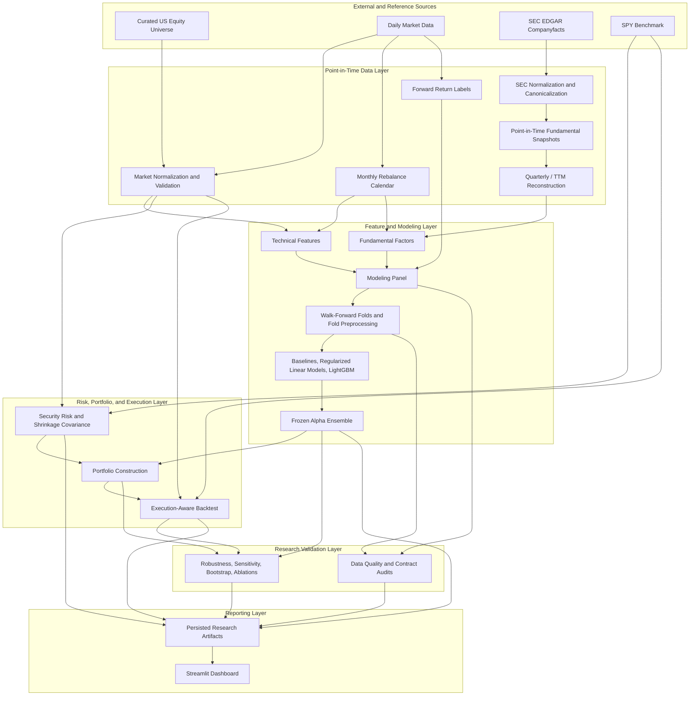

# System Architecture

## Purpose

The Institutional Quant Equity Research Platform is an end-to-end research system for
cross-sectional equity selection, risk-aware portfolio construction, execution-aware
backtesting, robustness analysis, and interactive reporting.

The architecture is intentionally split into two planes:

- **Research pipeline** — produces validated datasets, out-of-sample predictions, frozen
  alpha signals, risk estimates, target portfolios, executed portfolio histories, and
  robustness evidence.
- **Reporting layer** — reads persisted research artifacts and exposes them through the
  Streamlit application without retraining models or recomputing the research pipeline
  from the user interface.

This separation keeps research logic auditable and prevents presentation code from becoming
an implicit source of model or backtest state.

## Architectural principles

The system follows several design rules that are treated as research controls rather than
implementation details:

1. **Point-in-time correctness.** A feature can only use information that was available on or
   before its `as_of_date`.
2. **Temporal separation.** Training, validation, test, portfolio formation, and execution are
   ordered explicitly in time.
3. **Out-of-sample evaluation.** Stored model predictions used for research conclusions are
   generated through date-grouped walk-forward evaluation.
4. **Frozen research decisions.** The final ensemble is not reselected using the same
   out-of-sample period on which it is evaluated.
5. **Persistent stage outputs.** Material pipeline stages write Parquet, CSV, Markdown, model,
   or diagnostic artifacts that can be inspected independently.
6. **Contract-driven boundaries.** Data quality, leakage, portfolio constraints, risk,
   execution, robustness, and dashboard inputs are validated at stage boundaries.
7. **Configuration-first behavior.** Research settings are centralized in
   `config/project.yaml`, while implementation logic lives under `src/quant_equity/`.
8. **Reporting is downstream-only.** The Streamlit application consumes research artifacts;
   it does not train models or modify the frozen research state.

## End-to-end architecture



## Repository layers

| Layer | Primary location | Responsibility |
|---|---|---|
| Configuration | `config/` | Central research, portfolio, risk, execution, and runtime settings |
| Reference data | `data/reference/` | Universe metadata and mapping resources |
| Raw data | `data/raw/` | Source-preserving market and SEC inputs |
| Interim data | `data/interim/` | Normalized or canonicalized intermediate datasets |
| Processed data | `data/processed/` | Modeling, signal, risk, portfolio, execution, and dashboard artifacts |
| Data services | `src/quant_equity/data/` | Market ingestion, SEC normalization, point-in-time joins, universe loading |
| Feature engineering | `src/quant_equity/features/` | Technical and fundamental predictors and their audits |
| Labels | `src/quant_equity/labels/` | Rebalance dates and future-return targets |
| Validation | `src/quant_equity/validation/` | Walk-forward folds, fold preprocessing, readiness, and leakage audits |
| Models | `src/quant_equity/models/` | Baselines, linear models, LightGBM models, diagnostics, ensemble logic |
| Research analysis | `src/quant_equity/research/` | Factor and model research utilities |
| Risk | `src/quant_equity/risk/` | Security-level risk, covariance, and portfolio risk analytics |
| Portfolio | `src/quant_equity/portfolio/` | Baselines, constrained optimization, CVaR, and Median-MAD construction |
| Backtest | `src/quant_equity/backtest/` | Position evolution, execution costs, trades, and performance |
| Reporting services | `src/quant_equity/reporting/` | Dashboard data contracts, metrics, robustness, and validation adapters |
| Application | `app/` | Streamlit shell, views, data access, and chart components |
| Research outputs | `reports/` | Tables, Markdown reports, figures, validation evidence, and robustness results |
| Tests | `tests/` | Automated unit, contract, regression, dashboard, and integration checks |
| Entry points | `scripts/` | Reproducible executable research workflows |

## Data and temporal architecture

### Universe contract

The configured research universe contains 50 US large-cap equities and 11 sectors. The
current universe is a **static curated universe applied historically**. This is explicitly
represented by the configuration value
`membership_mode: current_constituents_applied_historically`.

That design is suitable for the current research platform, but it introduces survivorship and
historical-membership limitations. The robustness framework therefore treats a genuine
expanded-universe experiment as a deferred limitation rather than simulating one by merely
excluding securities from the existing 50-name universe.

### Market data

Market data is ingested through an encapsulated provider layer and normalized into a long-form
daily dataset. The market pipeline validates coverage, duplicated keys, price validity,
missingness, extreme returns, and adjustment behavior before downstream use.

The principal processed market artifact is:

`data/processed/market_daily.parquet`

The configured history begins on `2014-01-01`. Market-derived rolling windows terminate at
the relevant `as_of_date`; future sessions are not available to predictors.

### SEC fundamentals

Fundamental data follows a point-in-time pipeline:

1. SEC Companyfacts source data is stored independently from derived features.
2. XBRL concepts are normalized and mapped to canonical financial metrics.
3. Period duration and statement semantics are classified.
4. Quarterly observations and trailing-twelve-month measures are reconstructed where
   appropriate.
5. Availability is constrained by filing time, with the configured operational lag applied.
6. Only information available by the portfolio observation date is eligible for feature
   construction.

The current configuration applies a one-day availability lag and rejects incompatible
statement-duration semantics during point-in-time selection.

### Rebalance dates and targets

Research observations are monthly and aligned to the last available market session of each
rebalance month.

The primary forward target is the 21-session relative return:

\[
y_{i,t}
=
R_{i,t+1:t+21}
-
\operatorname{median}_{j \in U_t}
\left(R_{j,t+1:t+21}\right)
\]

The architecture separates the future label from the information set used to construct
features. The prediction is formed using data available at `as_of_date`; the future-return
window begins after that observation date.

The label pipeline also materializes the absolute 21-session return and the top-quintile
classification used in model diagnostics.

## Feature architecture

### Technical predictors

Technical features are created from historical price and liquidity information using past-only
rolling windows. The configured families include:

- momentum over long and intermediate horizons;
- recent returns and reversal signals;
- short- and long-window volatility;
- drawdown;
- moving-average distances and trend measures;
- liquidity and trading-activity measures.

Cross-sectional processing includes winsorization, standardization, and sector
neutralization. The current frozen modeling contract contains 19 technical predictors.

Relevant modules include:

- `src/quant_equity/features/technical.py`
- `src/quant_equity/features/technical_pipeline.py`
- `src/quant_equity/features/technical_processing.py`
- `src/quant_equity/features/technical_processing_pipeline.py`
- `src/quant_equity/features/technical_validation.py`

### Fundamental predictors

Fundamental features are derived from point-in-time accounting information rather than from
period-end dates alone. The pipeline separates raw factor calculation from growth metrics,
cross-sectional transformations, and validation.

The current frozen feature contract contains 72 fundamental predictors:

- 24 globally standardized fundamental factors;
- 24 sector-standardized versions;
- 24 missingness indicators.

The factors represent value, quality, growth, leverage, investment, accrual, profitability,
cash-flow, and balance-sheet characteristics where the underlying SEC data supports them.

Relevant modules include:

- `src/quant_equity/features/fundamental_base.py`
- `src/quant_equity/features/fundamental_factors.py`
- `src/quant_equity/features/fundamental_growth.py`
- `src/quant_equity/features/fundamental_transforms.py`
- `src/quant_equity/features/fundamental_audit.py`

Detailed definitions remain in `docs/FEATURE_DICTIONARY.md` and
`docs/DATA_DICTIONARY.md`.

## Modeling panel

The modeling panel is the canonical cross-sectional dataset joining:

- `as_of_date`;
- ticker and sector metadata;
- 19 technical predictors;
- 72 fundamental predictors;
- forward-return targets and the top-quintile label.

The current frozen panel therefore exposes 91 predictors. The panel is persisted as:

`data/processed/modeling_panel.parquet`

This dataset is not considered valid merely because the join succeeds. Dedicated audit and
readiness modules verify key uniqueness, temporal alignment, feature coverage, target
semantics, point-in-time fundamentals, and downstream modeling requirements.

Relevant modules include:

- `src/quant_equity/models/modeling_panel.py`
- `src/quant_equity/validation/modeling_panel_audit.py`
- `src/quant_equity/validation/modeling_panel_readiness.py`

## Walk-forward validation

Random train/test splitting is not used for the final research evaluation. Validation is
grouped by `as_of_date`, so the full cross-section for a month remains in the same temporal
fold.

The configured walk-forward contract uses:

- expanding training history;
- a minimum of 60 training months;
- 12 validation months;
- monthly out-of-sample testing;
- an out-of-sample start in 2020;
- past-only fold preprocessing.

The materialized research run contains 77 out-of-sample folds, with signal dates from
2020-01-31 through 2026-05-29.

Fold-level preprocessing is isolated from future observations. Scaling, imputation,
hyperparameter selection, and any fit-dependent transformations must be learned inside the
eligible training/validation information set rather than from the complete panel.

Relevant modules include:

- `src/quant_equity/validation/walk_forward.py`
- `src/quant_equity/validation/fold_preprocessing.py`
- `src/quant_equity/validation/linear_walk_forward.py`
- `src/quant_equity/validation/walk_forward_readiness.py`

## Predictive modeling and frozen ensemble

The modeling layer contains transparent baselines and progressively more flexible models:

- technical / momentum baselines;
- composite factor baselines;
- Ridge;
- Elastic Net;
- LightGBM regression;
- LightGBM ranking.

Model evaluation is cross-sectional and emphasizes ranking quality rather than only
point-estimate error. Research outputs include monthly Information Coefficient, quintile
profiles, top-quintile precision, yearly and sector stability, feature importance, coefficient
stability, and ranking turnover.

The final alpha layer combines three frozen components into a common ranking representation.
Its principal persisted artifact is:

`data/processed/final_alpha_signal.parquet`

The frozen signal is a research-governance boundary. Ablation experiments are diagnostic:
they quantify dependence on feature or model families but do not authorize retrospective
replacement of the frozen full model using the same out-of-sample evaluation period.

## Risk architecture

Risk estimation is downstream of the market-data layer and independent from the dashboard.

The security-level risk layer estimates:

- annualized volatility;
- beta relative to SPY;
- liquidity / Average Dollar Volume measures;
- inputs required for portfolio constraints.

The covariance layer uses a 252-session lookback, requires a minimum historical sample, and
uses Ledoit-Wolf shrinkage.

Principal artifacts include:

- `data/processed/risk_estimates.parquet`
- `data/processed/covariance_matrices.parquet`

Portfolio-level risk functions transform these estimates and portfolio weights into volatility,
beta, sector exposure, concentration, and risk-contribution diagnostics.

## Portfolio construction

The platform intentionally compares multiple mappings from alpha rankings to target weights
rather than assuming that one optimizer is universally superior.

The current portfolio methods are:

- `top_n_equal_weight`;
- `score_weighted`;
- `alpha_risk_turnover`;
- `cvar`;
- `median_mad_de`.

The common portfolio contract is long-only and fully invested, with a maximum 5% security
weight and a maximum 25% sector weight. The advanced portfolio layer also incorporates
minimum diversification, beta, liquidity, and turnover controls where applicable.

### Alpha-risk-turnover optimizer

The constrained optimizer combines expected alpha, covariance risk, and turnover:

\[
\max_w
\left(
\hat{\alpha}^{\top}w
-
\lambda w^{\top}\Sigma w
-
\eta \lVert w-w_{\mathrm{prev}}\rVert_1
\right)
\]

Additional hard constraints control security concentration, sector exposure, beta, and
liquidity capacity.

### CVaR construction

The CVaR implementation evaluates adverse return scenarios over a historical lookback and
adds a tail-risk penalty to portfolio construction. It uses the same high-level portfolio
constraints so that comparisons remain economically interpretable.

### Median-MAD Differential Evolution

The Median-MAD method is a robust portfolio-construction alternative based on the median of
historical portfolio returns and the mean absolute deviation around that median.

The current configuration uses:

- 252-session lookback;
- at least 126 observations;
- MAD limit of `0.008`;
- turnover penalty of `0.001`;
- deterministic seed `42`;
- Differential Evolution with 80 maximum iterations and population size 8.

Candidates are projected into the feasible portfolio region and are evaluated with security,
sector, beta, liquidity, and turnover constraints inherited from the portfolio layer.

This implementation adapts the robust Median-MAD and Differential Evolution ideas developed
in the earlier portfolio-optimization work to the current equity-ranking platform. It is one
portfolio-construction method within the broader research system rather than the definition of
the platform itself.

## Execution and backtesting

Target weights do not directly become performance results. The execution layer models the
transition from target portfolios to implementable holdings and records:

- shares and position values;
- weight drift between rebalances;
- orders and trades;
- one-way turnover;
- commissions;
- spread;
- slippage;
- market impact;
- gross and net portfolio returns.

The advanced configured cost components are:

- commission: 0.5 bps;
- half-spread: 2.0 bps;
- slippage: 2.5 bps;
- market-impact coefficient: 0.10.

The research layer also evaluates fixed cost scenarios and multiple capital scales for
capacity analysis.

Principal executed artifacts include:

- `data/processed/backtest_all_methods_gross_daily.parquet`
- `data/processed/backtest_all_methods_net_daily.parquet`
- `data/processed/positions_all_methods_net.parquet`
- `data/processed/trades_all_methods_net.parquet`

## Robustness architecture

Robustness is implemented as a separate research layer rather than as parameter tuning inside
the final model.

The current framework covers:

- market regimes and calendar subperiods;
- transaction-cost sensitivity;
- capacity;
- portfolio top-N and weight-cap sensitivity;
- rebalance-frequency sensitivity;
- rolling evaluation windows;
- alternative prediction horizons;
- universe exclusions;
- monthly bootstrap;
- sector stability;
- ensemble-component ablation;
- feature-family ablation;
- portfolio-construction ablation.

The genuine expanded-universe dimension remains a documented limitation because adding new
securities requires rebuilding the full point-in-time data and modeling pipeline.

Robustness results are persisted under `reports/robustness/` and `reports/tables/`, making the
evidence inspectable independently from the dashboard.

## Data quality and validation contracts

Quality control is distributed across the architecture. Each major boundary has an explicit
contract.

| Boundary | Main controls | Representative evidence |
|---|---|---|
| Universe | unique tickers, metadata completeness, expected count | `tests/test_universe.py` |
| Market data | unique date/ticker keys, coverage, valid prices, missingness, anomalies | `reports/data_quality/market_data_report.md` |
| Labels | target starts after `as_of_date`, correct horizon, manual calculation checks | `reports/data_quality/monthly_labels_report.md` |
| Technical features | past-only windows, coverage, transformations, selection | `tests/test_technical_features.py` |
| Fundamentals | filing availability, canonical concepts, quarterly reconstruction, point-in-time selection | fundamental data-quality reports and SEC tests |
| Modeling panel | unique panel keys, leakage checks, feature/target availability | `reports/data_quality/modeling_panel_final_audit.md` |
| Walk-forward | chronological folds, grouped dates, preprocessing isolation | `reports/validation/walk_forward_validation_report.md` |
| Models | OOS-only predictions, evaluation semantics, frozen signal checks | model reports and predictive-evaluation audits |
| Risk | estimation windows, covariance validity, security-level checks | risk reports and risk test suite |
| Portfolio | fully invested, long-only, security/sector limits, diversification | portfolio diagnostics and checks |
| Execution | trade accounting, cost components, position continuity | execution checks and comparison reports |
| Robustness | scenario completeness, paired comparisons, ablation contracts | robustness check inventory |
| Dashboard | artifact schemas, source contracts, semantic checks | dashboard source and validation audits |

The project uses automated tests and persisted audit tables together: tests protect
implementation behavior, while reports preserve evidence from the materialized research run.

## Reporting and dashboard separation

The application is implemented under `app/` and consists of a shared shell, data access layer,
chart components, and eight views:

1. Overview
2. Alpha & Ranking
3. Portfolio
4. Risk
5. Execution & Capacity
6. Models & Factors
7. Robustness
8. Data Quality

The dashboard consumes persisted outputs generated by the research pipeline. It does not
perform model fitting, hyperparameter search, portfolio research selection, or robustness
re-estimation from the interface.

This boundary is important for two reasons:

- dashboard interactions cannot alter the research conclusions;
- a lightweight portfolio/demo clone can run from a curated set of versioned artifacts without
  rebuilding SEC, model-training, optimization, and robustness stages.

Dashboard source adapters live in `src/quant_equity/reporting/`, while page composition lives
in `app/views/`.

## Artifact lineage

The principal lineage is:

```text
reference universe
    + daily market data
    + SEC filings
        -> point-in-time normalized data
        -> monthly technical and fundamental features
        -> labels
        -> modeling panel
        -> walk-forward OOS predictions
        -> frozen alpha signal
        + security risk / covariance
        -> target portfolios
        -> executed positions and trades
        -> gross / net backtests
        -> robustness and validation evidence
        -> dashboard-ready artifacts
```

The persisted-artifact design allows any downstream result to be traced to an upstream dataset
rather than existing only inside a notebook or application session.

## Temporal semantics of the current research release

Several dates describe different stages of the same release and should not be conflated:

| Meaning | Current release |
|---|---:|
| Last frozen alpha signal date | 2026-05-29 |
| Last evaluated portfolio day | 2026-06-30 |
| Last stored raw SPY market date | 2026-07-27 |

The difference is expected. Prediction horizons, holding periods, benchmark coverage, and raw
data refreshes have different terminal dates.

## Reproducibility boundary

There are two distinct reproducibility targets.

### Dashboard reproduction

A clean clone can reproduce the interactive reporting experience from the curated processed
artifacts committed for the dashboard release. This path does not require rebuilding the
historical SEC dataset or retraining models.

### Full research reconstruction

Reconstructing the entire research pipeline additionally requires:

- external market data access;
- SEC EDGAR access and a valid identifying user agent;
- raw and intermediate data reconstruction;
- feature generation;
- walk-forward training;
- risk estimation;
- portfolio optimization;
- execution simulation;
- robustness experiments.

The exact command sequence and environment contract belong in `docs/reproducibility.md`.
Keeping this distinction explicit prevents a portable dashboard release from being
misrepresented as a fully self-contained historical data archive.

## Known architectural limitations

The architecture deliberately records limitations rather than hiding them:

- the 50-name universe is static and therefore does not provide historical index membership;
- a genuine expanded-universe robustness experiment has not been executed;
- yfinance is suitable for this research implementation but is not an institutional market-data
  feed;
- SEC Companyfacts normalization depends on issuer XBRL reporting quality and concept
  mapping;
- execution costs and market impact are models, not reconstructed historical order-book fills;
- portfolio backtests are research simulations rather than live trading records;
- results are specific to the documented OOS period and should not be treated as guarantees of
  future performance.

## Related documentation

Existing detailed references remain authoritative for their specialized domains:

- `docs/UNIVERSE_METHODOLOGY.md`
- `docs/LABELS_AND_REBALANCING.md`
- `docs/TECHNICAL_FEATURES.md`
- `docs/TECHNICAL_FEATURE_PROCESSING.md`
- `docs/FEATURE_DICTIONARY.md`
- `docs/DATA_DICTIONARY.md`

The next documentation layers should complement this architecture overview rather than
duplicate it:

- `docs/reproducibility.md` — environment, installation, release artifacts, full pipeline
  execution, determinism, and integrity checks.
- `docs/methodology.md` — research question, features, targets, leakage prevention, models,
  portfolio methods, execution, statistical testing, and interpretation.
- `docs/research_results.md` — frozen predictive evidence, portfolio outcomes, risk, execution,
  capacity, robustness, and limitations.
